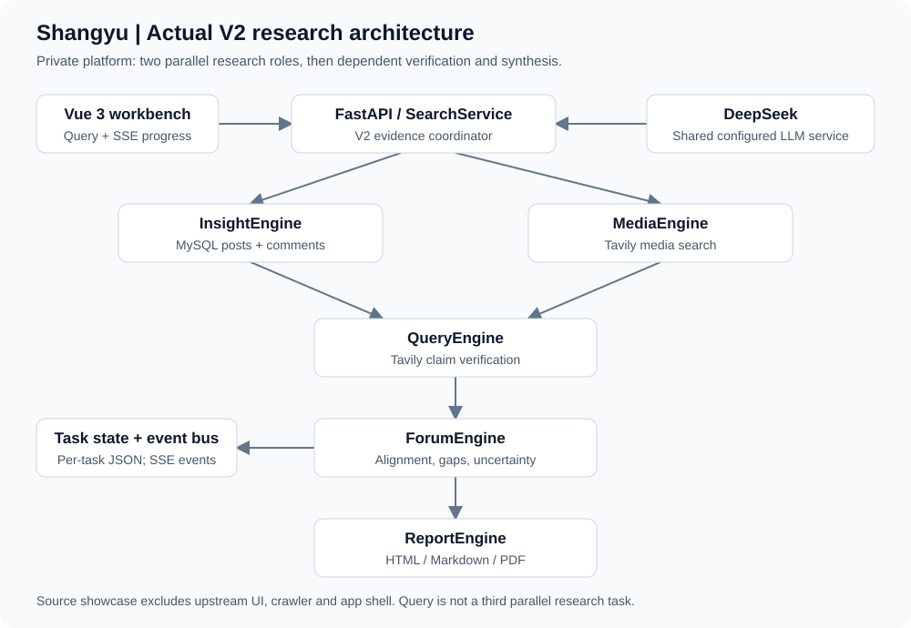
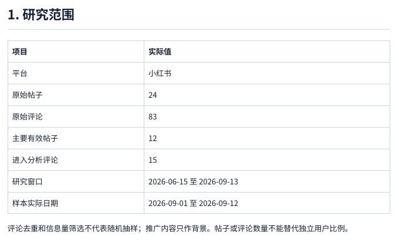
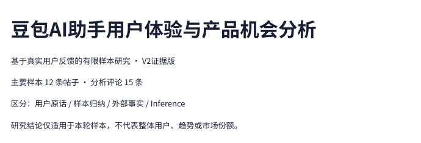
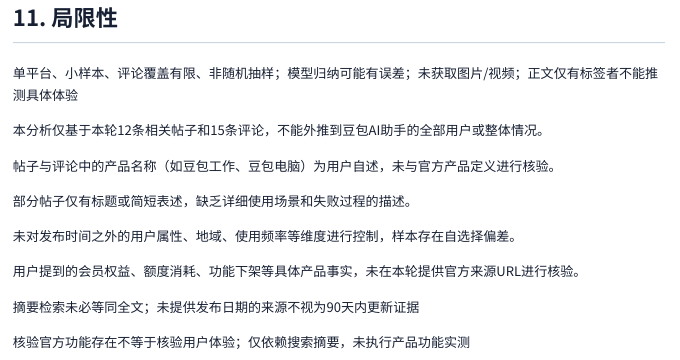

# Shangyu

**Multi-Agent AI Product Sentiment & User Feedback Intelligence Platform**

[中文文档](README.zh-CN.md) · [Case study](docs/case-study-doubao.md) · [Code walkthrough](docs/code-walkthrough.md)

Shangyu combines real social-media feedback, web search, LLM reasoning, fact verification and evidence-aware reports for AI product research.

**Real-world demo:** Doubao AI Assistant user experience, reputation and product opportunities — **24 real posts · 83 real comments**, rechecked on 2026-09-13.

**Stack used in the private platform:** Python · FastAPI · Vue 3 · MySQL · DeepSeek · Tavily · SSE · WeasyPrint.



|✓ Validated locally|✓ Quality work|Scope|
|---|---|---|
|Real social data; multi-role research|Comment integration; bad-case evaluation|One small private case|
|Web search and bounded verification|Evidence-aware conclusions|LLM results still reviewed|
|SSE progress; HTML/MD/PDF reports|Persisted state and source cards|Local demo, not production monitoring|



> **PORTFOLIO_ONLY:** This repository contains original local additions, documentation and executable offline contracts, not the complete platform. Some third-party components are excluded from this public portfolio due to their original licensing terms. See [license review](docs/LEGAL_AND_LICENSE.md). No raw dataset, login state or original UI/logo assets are included.

## Overview
A multi-agent AI research platform for analyzing real-world user feedback, public sentiment, external media, product facts, and evidence-backed product opportunities. This candidate is a job-portfolio account of a privately reproduced system and its evidence-quality improvements.

## Why This Project / Why this matters
Most LLM demos focus on generation. This work focuses on data quality, evidence quality, source verification, bad cases and turning AI outputs into testable product hypotheses. It does not claim validated representative sentiment monitoring.

## Demo Case: Doubao AI Assistant
Learning and office scenarios, bounded to the collected sample. Actual posts clustered on Sep 1–12 within a requested 90-day window. Findings include spreadsheet reporting, iterative drawing and conflicting coding impressions. Read the [evidence → judgment → product meaning case](docs/case-study-doubao.md).

## Key Results
|Measured private case|Result|
|---|---|
|Fresh database scope|24 posts / 83 comments|
|Primary model input|12 posts / 15 comments|
|Relevant development predictions|17/17; total n=24|
|Core citation coverage|5/5|
|Fact audit|17 supported / 3 partially supported; n=20|
|Product / operations hypotheses|1 / 2|
|Verified exports|HTML / Markdown / 15-page PDF|

The precision result is in-sample development evaluation with assistant-assisted labels, not model accuracy. Citation coverage does not prove user statements objectively true. V1/V2 prompts differ; this is not a controlled A/B test.

## Architecture / Multi-Agent Workflow
Vue 3 → FastAPI/SearchService → **Insight + Media in parallel** → Query verification → Forum synthesis → Report. Query deliberately waits for upstream targets. [Architecture](docs/architecture.md) · [workflow drawing](docs/assets/workflow.svg).

## Agent Responsibilities
Insight: user sample. Media: external statements. Query: claim verification. Forum: evidence alignment/gaps. Report: supported conclusions and labeled hypotheses. [Inputs, tools, outputs and failures](docs/agent-design.md).

## Real Data Pipeline / Evidence-aware Analysis
Prior approved collection → MySQL → explicit post/comment join → relevance and information filtering → actual model payload → quote/ID checks → findings. Nothing enters the model just because it exists in MySQL. [Pipeline details](docs/data-pipeline.md).

## From V1 to V2 / Bad Cases & Iteration
V1 exposed irrelevant posts, missed comments, empty Media context, weak sources and LLM over-generalization. V2 added relevance filtering, comment integration, source grading, claim verification, evidence cards and bad-case evaluation. [Real failures and fixes](docs/bad-cases.md). Corrective outputs are not hidden; the final case includes assistant review.

## My Work
- Reproduced the existing system on Windows with separate environments and local storage; integrated configured DeepSeek/Tavily and verified MySQL data.
- Traced the real data-to-prompt chain, debugged APIs/exports and added the V2 evidence workflow with AI coding assistance.
- Verified real engine/state/SSE/report artifacts, created evaluations and product/operations hypotheses, and prepared a privacy-minimized portfolio.
- **Upstream:** architecture, original agents/prompts, UI and crawler integration. I do not claim to have designed the entire platform from scratch. [Attribution](NOTICE.md).

## Product Perspective
Supports VOC triage, research planning, feature/opportunity discovery and content-operation hypotheses. Sentiment/risk monitoring is an exploratory use case; frequency, causal impact and continuous coverage are not demonstrated.

## LLM Application Perspective
Role orchestration, tool integration, structured outputs, stage state, SSE, external search, claim verification and report rendering. A shared evidence contract makes failures inspectable; more agents alone do not establish quality.

## Evaluation
[Methodology](docs/evaluation.md) · [aggregate results](evaluation/sample_results.json) · [private evidence hashes](evaluation/provenance.json). Public fixtures are separately labeled and do not reproduce the private collection.

## Demo
Three actual report crops, not recreated UI or live-running-agent claims. [Image provenance](docs/assets/screenshots/README.md).




An [offline aggregate summary](docs/assets/demo/public-demo.html) contains no raw comments or original user IDs. The full original report is intentionally private.

## Tech Stack
The private platform used Python 3.11, FastAPI, Vue 3/TypeScript/Pinia/Element Plus/Vite, MySQL 8, DeepSeek, Tavily and WeasyPrint. This portfolio's offline contracts use Python standard library; its documentation builder uses Node built-ins. LangGraph/sentiment dependencies belong to the larger upstream application, not a claimed new trained model.

## Project Structure / Code Walkthrough
`integration/`: newly added source references; `portfolio_code/`: executable pure extracts; `docs/`: case, architecture and interview material; `evaluation/`: real aggregates; `examples/`: minimized teaching examples; `scripts/`: offline checks. [Ten review entries](docs/code-walkthrough.md).

## Quick Start
In this extracted portfolio directory, with Python 3.11+ and Node 22+:

```sh
python -m unittest discover -s tests -v
npm run build
npm run dev
```

Open `<preview-origin>`/docs/assets/demo/public-demo.html. This serves a static portfolio summary, **not the omitted Vue application**. No keys, npm dependencies or database needed. [Detailed quickstart](docs/quickstart.md).

## Configuration / API
`.env.example` documents blank private-platform variables and is not loaded by offline tests. [Inspected API map](docs/api.md). Full deployment requires separately authorized upstream components; the compose example serves documentation only.

## Limitations
Single-platform convenience sample, small n, external API dependency, variable source quality, unknown source dates, no image/video reading and assistant-reviewed LLM outputs. Not designed or validated for production-scale crawling. Independent blind evaluation and cross-product generalization are planned, not completed.

## Responsible Use
For research and learning only. Respect platform terms and MediaCrawler's own license; limit request rates, never bypass CAPTCHAs or access controls, collect no private information, and perform no unauthorized commercial scraping. No API keys, private cookies, authentication data, raw profiles or bulk comments are included. Examples are minimized/paraphrased and labeled. [Privacy](docs/privacy.md) · [security](docs/security.md). CI performs no paid calls or crawling. Both required GitHub Actions passed for the first published commit; see the [publication record](PUBLISHED_RELEASE_RECORD.md). The preview and private platform are for local development; authentication, rate limiting and RBAC have not been demonstrated for public production use.

## License & Attribution
No blanket MIT/Apache license. Full upstream redistribution is not cleared. Some third-party components used during local research are excluded from this public portfolio because of their original licensing terms. See the [upstream project](https://github.com/JxKim/sentiment_analysis_platform), [final license audit](FINAL_LICENSE_AUDIT.md), [third-party notices](THIRD_PARTY_NOTICES.md) and [manifest](publish_manifest.json). Original additions are source-visible under default copyright; no additional open-source reuse license is granted.

Interview resources: [中文面试提纲](docs/interview-notes.zh-CN.md) · [resume bullets](docs/resume-bullets.md).
